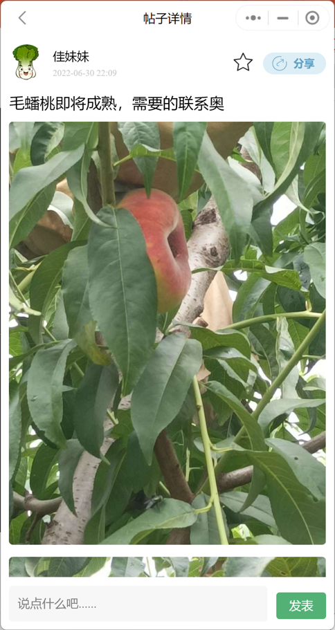

#  概述

农产道小程序是一个关于农业的微信原生小程序，具有推荐/论坛/电商/后台模块。采用微信云开发快速开发项目，后台管理使用腾讯云CMS内容管理快速搭建。

##  什么是微信云开发？

简而言之，就是无需服务器，几行代码就可以快速开发一个小程序。


#  技术栈

* 微信小程序原生框架
* Mobx状态管理库
* 微信云开发（云函数、云存储、云数据库）
* 腾讯云内容管理CMS

#  功能实现

##  整体架构

###  项目主要模块

‘项目主要分为四大模块：

1. 首页模块
2. 农友圈
3. 农资超市
4. 我的模块


###   项目业务功能实现


###  项目目录结构


##  页面展示

###  首页模块

<div style="display: flex;">
    
    
     
</div>


###  农友圈模块

<div style="display:flex;">
    
    
    
    
</div>

### 农资超市模块

<div style="display:flex;">
    
    
    
    
</div>

###  我的模块

<div style="display:flex;">
    
</div>

#  本地运行

克隆项目

```sh
git clone https://github.com/yangyixiang-cc/Help-Nong-Bao-wapp.git
```

打开微信小程序开发工具将项目导入

* 更换APPID
* 选择使用微信云开发


点击项目文件，选择进入内建终端，进入 miniprogram目录：输入 `npm install`  安装项目依赖。


***

点击菜单栏->云开发按钮->创建一个云开发环境。


然后选择数据库按钮->创建集合


依次建立以下集合：

* address
* article
* colletArticle
* collectComment
* collectPost
* comments
* goods
* merchantSettlement
* notice
* order
* postCollectComment
* postComments
* posts
* state
* supportPost
* swiper
* tab
* users

然后依次导入项目根目录下的`data/json/`  下对应名称的`.json` 数据。

***

返回项目编辑器界面：打开 `app.js envList.js` 文件，更改云开发环境`ID` 。


然后右击 `cloudfunctions`  文件，选择当前云开发环境，然后同步云函数到云环境中。


***

然后打开云开发操作界面，选择更多->内容管理：

参照微信小程序开发文档->内容管理章节部署成功后打开内容管理平台：

[微信小程序开发文档->CMS内容管理章节](https://developers.weixin.qq.com/miniprogram/dev/wxcloud/guide/extensions/cms/guidance.html)


选择右侧的导入模型：


* 导入项目根目录下 `data/json/`下的 `schema-export-5ues1pu8.json` 文件即可

然后就可以在后台添加内容了


**注意：项目根目录下 `/data/img`  下的图片你可能会用到。**

***

最后点击编译项目即可。

#  反馈

如果您有任何反馈，请通过发送至[电子邮件](mailto:workyyx@163.com)与我联系。
